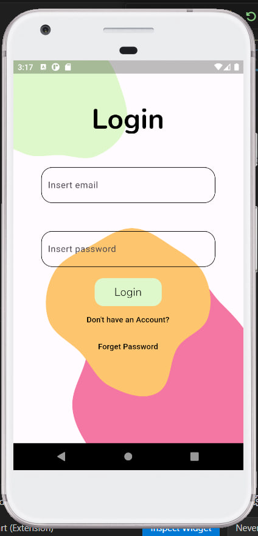
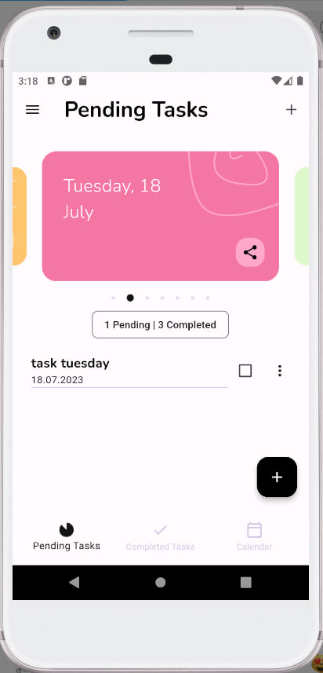
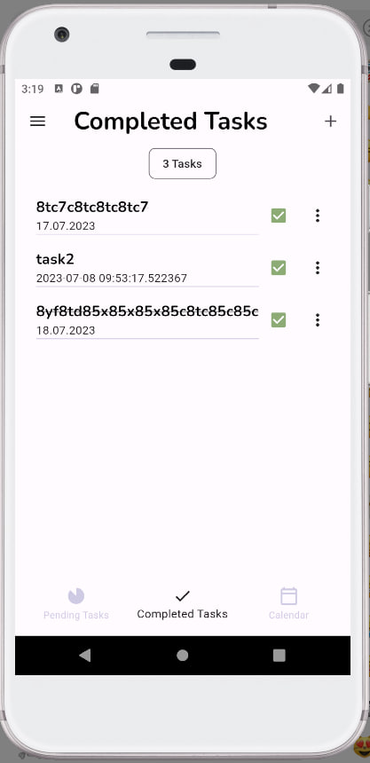
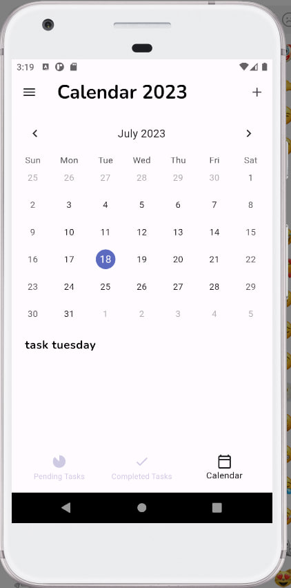
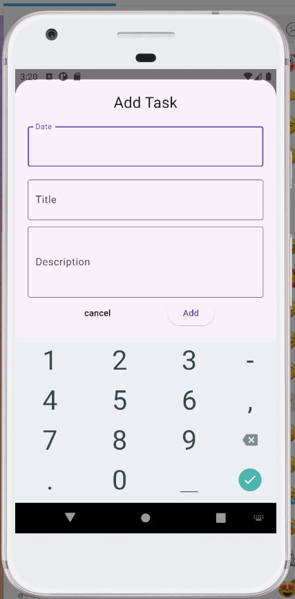

# To-do-List
An app for managing your personal to-do-list, using firebase.

### Functionality
- Log in/ Sign up
- Add task, edit task, delete task
- See calendar and add tasks based on data

### Technologies
- Flutter, Dart
- flutter_bloc: ^8.1.3
- intl: ^0.18.1
- path_provider: ^2.0.15
- equatable: ^2.0.5
- firebase_core: ^2.14.0
- firebase_auth: ^4.6.3
- cloud_firestore: ^4.8.2
- get_storage: ^2.1.1
- cupertino_icons: ^1.0.2
- carousel_slider: ^4.2.1
- table_calendar: ^3.0.9
- extended_masked_text: ^2.3.1
- share_plus: ^7.0.2

  ### UI

  <table>
  <tr>
    <td align="center">
      
    </td>
    <td align="center">
      
    </td>
    <td align="center">
      
    </td>
  </tr>
  <tr>
    <td align="center">
      
    </td>
     <td align="center">
      
    </td>
  </tr>
</table>
